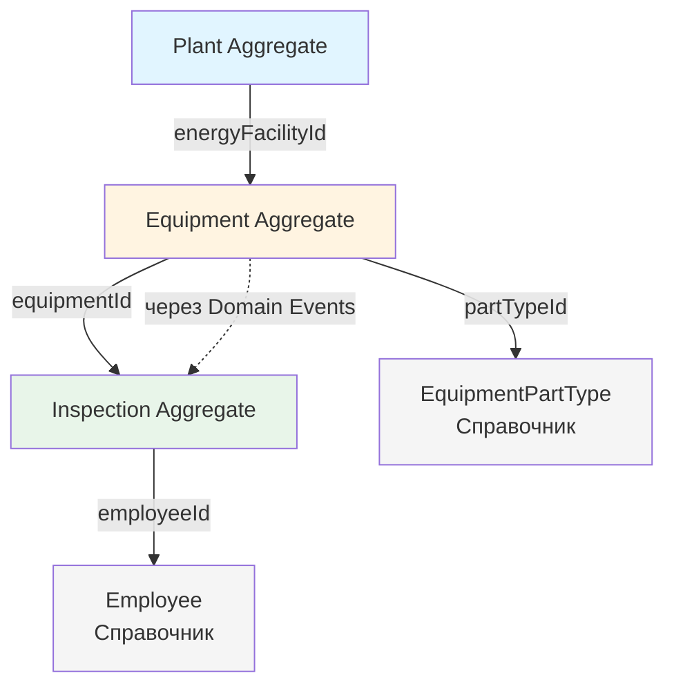

# DDD Агрегаты для системы контроля перегрева электрооборудования

## Обзор

Данный документ описывает агрегаты (Aggregates) в терминах Domain-Driven Design для системы контроля перегрева электрооборудования на электростанциях.

---

## 1. Plant Aggregate (Агрегат Станции)

### Aggregate Root
**Plant** - Электростанция

### Entities
- **EnergyFacility** - Энергообъект (часть станции)

### Value Objects
- PlantId (идентификатор с type safety)
- PlantName (с валидацией длины и формата)
- DeviceId (идентификатор устройства)
- UserId (идентификатор пользователя)
- GrabInfo (составная концепция блокировки)

### Граница агрегата
Станция и все её энергообъекты. Оборудование НЕ входит в этот агрегат.

### Инварианты
1. **Уникальность имени станции** в рамках системы
2. **Блокировка станции**: В каждый момент времени только одно устройство может редактировать справочные данные станции (энергообъекты)
3. **Логическое удаление**: Станции и энергообъекты помечаются флагом `isDeleted`, но не удаляются физически
4. **Иерархическая целостность**: Энергообъект всегда принадлежит станции

### Бизнес-правила
- Станция создается только при наличии интернета (на центральном сервере)
- Энергообъекты можно создавать оффлайн, но только если станция заблокирована текущим устройством
- При попытке редактирования проверяется наличие grab'а

### Операции агрегата
```kotlin
class Plant(
    val id: PlantId,
    var name: PlantName,
    private val energyFacilities: MutableList<EnergyFacility>,
    var grabInfo: GrabInfo?,
    var isDeleted: Boolean
) {
    fun acquireGrab(deviceId: DeviceId, userId: UserId): Result<Unit>
    fun releaseGrab(deviceId: DeviceId): Result<Unit>
    fun addEnergyFacility(name: String, deviceId: DeviceId): Result<EnergyFacility>
    fun removeEnergyFacility(facilityId: EnergyFacilityId, deviceId: DeviceId): Result<Unit>
    fun markAsDeleted()
}
```

### Вспомогательные классы
```kotlin
import java.time.Instant

// Value Objects
@JvmInline
value class PlantId(val value: String) {
    init {
        require(value.isNotBlank()) { "ID станции не может быть пустым" }
    }
}

@JvmInline
value class PlantName(val value: String) {
    init {
        require(value.isNotBlank()) { "Название станции не может быть пустым" }
        require(value.length <= 100) { "Название станции слишком длинное (максимум 100 символов)" }
    }
}

@JvmInline
value class DeviceId(val value: String) {
    init {
        require(value.isNotBlank()) { "ID устройства не может быть пустым" }
    }
}

@JvmInline
value class UserId(val value: String) {
    init {
        require(value.isNotBlank()) { "ID пользователя не может быть пустым" }
    }
}

data class GrabInfo(
    val deviceId: DeviceId,
    val timestamp: Instant,
    val userId: UserId
)

// Entity
data class EnergyFacility(
    val id: EnergyFacilityId,
    var name: String,
    val plantId: PlantId,
    var isDeleted: Boolean = false
)

@JvmInline
value class EnergyFacilityId(val value: String)
```

### Репозиторий
```kotlin
interface PlantRepository {
    suspend fun findById(id: PlantId): Plant?
    suspend fun findAll(): List<Plant>
    suspend fun save(plant: Plant)
    suspend fun findByGrabDevice(deviceId: DeviceId): Plant?
}
```

---

## 2. Equipment Aggregate (Агрегат Оборудования)

### Aggregate Root
**Equipment** - Электрооборудование

### Entities
- **ControlPointGroup** - Группа контрольных точек по типу узла
- **Defect** - Дефект (перегрев)

### Value Objects
- EquipmentId (идентификатор с type safety)
- EquipmentName (с валидацией)
- InventoryNumber (с валидацией формата)
- QRCode (с валидацией формата)
- ControlPointCount (с валидацией неотрицательности)
- StickerCount (с валидацией: не больше чем контрольных точек)
- EstimatedPointCount (оценочное количество для планирования)
- ControlPointGroupId, DefectId (идентификаторы)
- EquipmentTypeId (ссылка на справочник типов оборудования)

### Enums
- DefectStatus (DETECTED - Обнаружен, RESOLVED - Устранен)
- Severity (CRITICAL - Критический, EMERGENCY - Аварийный, DEVELOPING - Развивающийся)

### Граница агрегата
Оборудование, его группы контрольных точек и все дефекты на этом оборудовании.

### Инварианты
1. **Уникальность QR-кода** в рамках системы
2. **Уникальность инвентарного номера** в рамках энергообъекта
3. **Уникальность дефекта**: На оборудовании не может быть двух активных дефектов с одинаковым описанием узла
4. **Целостность групп контрольных точек**: Группа всегда принадлежит конкретному оборудованию
5. **Целостность дефектов**: Дефект всегда привязан к конкретному оборудованию (с указанием конкретного узла)
6. **Количество контрольных точек**: Неотрицательное число, определяется типом оборудования
7. **Количество наклеек**: Не может превышать количество контрольных точек в группе
8. **Инициализация по типу**: При создании оборудования группы контрольных точек копируются из справочника типа оборудования

### Концепции предметной области

#### Контрольная точка (Control Point)
Место на оборудовании, температуру которого нужно контролировать. Это **свойство самого оборудования**, а не что-то, что можно создать или наклеить. Количество контрольных точек влияет на стоимость осмотра.

#### Три количественных показателя:

1. **Количество контрольных точек (point_count)** - реальное количество мест, требующих контроля температуры. Вводится в разрезе типа узла оборудования (например, "30 БКС"). Влияет на стоимость работ.

2. **Количество установленных наклеек (sticker_count)** - фактическое количество наклеек, установленных на узлы данного типа. Вводится в разрезе типа узла и типа наклейки. Должно быть ≤ point_count.

3. **Оценочное количество контрольных точек (estimated_point_count)** - приблизительная оценка на уровне оборудования или энергообъекта. Используется для планирования потребности станции в наклейках. НЕ влияет на цену работ.

#### Тип оборудования (Equipment Type)
Определяет набор контролируемых узлов. Типов немного: 4 разновидности двигателей и 3 разновидности РУ в щитах. Каждый тип узла имеет:
- Название (полное и сокращенное, например "БКС" - болтовое контактное соединение)
- Максимальную температуру (t_max, °C)
- Максимальное превышение над температурой окружающей среды (t_excess, °C)
- Дефолтный тип наклейки

#### Узел оборудования (Equipment Unit)
Существует два уровня детализации:
1. **Тип узла** (например, "БКС") - используется для группировки контрольных точек. В оборудовании может быть много однотипных узлов (30 БКС), которые не учитываются индивидуально.
2. **Конкретный узел** (например, "верхний БКС фаза В") - указывается только в дефекте для точной локализации проблемы.

#### Эталонные температуры в дефектах
При создании дефекта эталонные температуры (t_max и t_excess) копируются из соответствующей группы контрольных точек (ControlPointGroup). Это создает "снимок" эталонных значений на момент обнаружения дефекта. Инспектор также может задать эти значения вручную, если дефект относится к нестандартному узлу или требуется корректировка эталонов.

### Бизнес-правила
- Оборудование можно создавать оффлайн (если станция заблокирована)
- При создании оборудования выбирается тип, и автоматически создаются группы контрольных точек согласно типу (копируются названия и температурные параметры из справочника, а не ссылки)
- Оборудование может иметь нестандартные группы контрольных точек, не соответствующие типу
- Дефект создается через шаг осмотра, но живет независимо
- При создании дефекта указывается конкретный узел (например, "верхний БКС фаза В") и тип контрольной точки (например, "БКС")
- При создании дефекта эталонные температуры (t_max, t_excess) автоматически копируются из соответствующей группы контрольных точек, но могут быть заданы вручную
- При создании дефекта проверяется отсутствие дубликатов (по конкретному узлу)
- Дефект может редактировать любой инспектор
- История дефекта реконструируется через шаги осмотров
- Количество наклеек в группе не может превышать количество контрольных точек

### Операции агрегата
```kotlin
class Equipment(
    val id: EquipmentId,
    var name: EquipmentName,
    var inventoryNumber: InventoryNumber?,
    var qrCode: QRCode?,
    val energyFacilityId: EnergyFacilityId,
    val equipmentTypeId: EquipmentTypeId?,
    var estimatedPointCount: EstimatedPointCount?,
    private val controlPointGroups: MutableList<ControlPointGroup>,
    private val defects: MutableList<Defect>,
    var isContainer: Boolean,
    var isDeleted: Boolean
) {
    // Инициализация групп контрольных точек из типа оборудования
    fun initializeFromType(equipmentType: EquipmentType): Result<Unit>
    
    // Управление группами контрольных точек
    fun addControlPointGroup(
        controlPointTypeName: String,
        pointCount: Int,
        defaultStickerTypeId: StickerTypeId
    ): Result<ControlPointGroup>
    
    fun updateControlPointCount(groupId: ControlPointGroupId, newCount: Int): Result<Unit>
    fun updateStickerCount(
        groupId: ControlPointGroupId,
        stickerTypeId: StickerTypeId,
        count: Int
    ): Result<Unit>
    
    // Управление дефектами
    fun reportDefect(
        unitName: String,  // Конкретный узел, например "верхний БКС фаза В"
        description: String,
        severity: Severity,
        inspectionStepId: InspectionStepId
    ): Result<Defect>
    
    fun updateDefectStatus(
        defectId: DefectId,
        newStatus: DefectStatus,
        inspectionStepId: InspectionStepId
    ): Result<Unit>
    
    fun getActiveDefects(): List<Defect>
    fun getDefectsByUnitName(unitName: String): List<Defect>
    
    // Валидация
    private fun hasSimilarActiveDefect(unitName: String): Boolean
    private fun validateStickerCount(groupId: ControlPointGroupId, count: Int): Boolean
}
```

### Вспомогательные классы
```kotlin
import java.time.Instant

// Value Objects
@JvmInline
value class EquipmentId(val value: String) {
    init {
        require(value.isNotBlank()) { "ID оборудования не может быть пустым" }
    }
}

@JvmInline
value class EquipmentName(val value: String) {
    init {
        require(value.isNotBlank()) { "Название оборудования не может быть пустым" }
        require(value.length <= 200) { "Название оборудования слишком длинное (максимум 200 символов)" }
    }
}

@JvmInline
value class InventoryNumber(val value: String) {
    init {
        require(value.isNotBlank()) { "Инвентарный номер не может быть пустым" }
        require(value.matches(Regex("^[A-Z0-9-]{5,20}$"))) {
            "Неверный формат инвентарного номера (ожидается: A-Z, 0-9, дефис, 5-20 символов)"
        }
    }
}

@JvmInline
value class QRCode(val value: String) {
    init {
        require(value.isNotBlank()) { "QR-код не может быть пустым" }
        require(value.matches(Regex("^[A-Z0-9]{10,20}$"))) {
            "Неверный формат QR-кода (ожидается: A-Z, 0-9, 10-20 символов)"
        }
    }
    
    fun toDisplayFormat(): String = value.chunked(5).joinToString("-")
}

@JvmInline
value class ControlPointCount(val value: Int) {
    init {
        require(value >= 0) { "Количество контрольных точек не может быть отрицательным" }
    }
}

@JvmInline
value class StickerCount(val value: Int) {
    init {
        require(value >= 0) { "Количество наклеек не может быть отрицательным" }
    }
}

@JvmInline
value class EstimatedPointCount(val value: Int) {
    init {
        require(value >= 0) { "Оценочное количество контрольных точек не может быть отрицательным" }
    }
}

@JvmInline
value class ControlPointGroupId(val value: String) {
    init {
        require(value.isNotBlank()) { "ID группы контрольных точек не может быть пустым" }
    }
}

@JvmInline
value class EquipmentTypeId(val value: Int) {
    init {
        require(value > 0) { "ID типа оборудования должен быть положительным" }
    }
}

@JvmInline
value class StickerTypeId(val value: Int) {
    init {
        require(value > 0) { "ID типа наклейки должен быть положительным" }
    }
}

@JvmInline
value class DefectId(val value: String) {
    init {
        require(value.isNotBlank()) { "ID дефекта не может быть пустым" }
    }
}

enum class DefectStatus {
    DETECTED,    // Обнаружен
    RESOLVED     // Устранен
}

enum class Severity {
    CRITICAL,    // Критический
    EMERGENCY,   // Аварийный
    DEVELOPING   // Развивающийся
}

// Entities
data class ControlPointGroup(
    val id: ControlPointGroupId,
    val equipmentId: EquipmentId,
    var controlPointTypeName: String,  // Копируется из справочника, например "БКС"
    var pointCount: ControlPointCount,  // Количество контрольных точек этого типа
    var stickerCount: StickerCount,     // Количество установленных наклеек
    var stickerTypeId: StickerTypeId,   // Тип используемой наклейки
    var isDeleted: Boolean = false
) {
    init {
        require(stickerCount.value <= pointCount.value) {
            "Количество наклеек не может превышать количество контрольных точек"
        }
    }
    
    fun updateStickerCount(newCount: StickerCount) {
        require(newCount.value <= pointCount.value) {
            "Количество наклеек ($newCount) не может превышать количество контрольных точек ($pointCount)"
        }
        stickerCount = newCount
    }
}

data class Defect(
    val id: DefectId,
    val equipmentId: EquipmentId,
    val unitName: String,  // Конкретный узел, например "верхний БКС фаза В"
    val description: String,
    val severity: Severity,
    val detectedAt: Instant,
    val detectedInStepId: InspectionStepId,
    var status: DefectStatus,
    var resolvedAt: Instant? = null,
    var resolvedInStepId: InspectionStepId? = null
)

// Справочник типов оборудования (не агрегат, а справочная сущность)
data class EquipmentType(
    val id: EquipmentTypeId,
    val name: String,
    val controlPointTypes: List<ControlPointTypeTemplate>
)

data class ControlPointTypeTemplate(
    val name: String,           // Полное название, например "Болтовое контактное соединение"
    val shortName: String,      // Сокращение, например "БКС"
    val tMax: Int,              // Максимальная температура, °C
    val tExcess: Int,           // Максимальное превышение над температурой окружающей среды, °C
    val defaultStickerTypeId: StickerTypeId  // Дефолтный тип наклейки
)
```

### Репозиторий
```kotlin
interface EquipmentRepository {
    suspend fun findById(id: EquipmentId): Equipment?
    suspend fun findByQRCode(qrCode: QRCode): Equipment?
    suspend fun findByEnergyFacility(facilityId: EnergyFacilityId): List<Equipment>
    suspend fun save(equipment: Equipment)
    suspend fun findEquipmentWithActiveDefects(): List<Equipment>
}

// Репозиторий для справочника типов оборудования
interface EquipmentTypeRepository {
    suspend fun findAll(): List<EquipmentType>
    suspend fun findById(id: EquipmentTypeId): EquipmentType?
}
```

---

## 3. Inspection Aggregate (Агрегат Осмотра)

### Aggregate Root
**Inspection** - Осмотр

### Entities
- **InspectionStep** - Шаг осмотра
- **Photo** - Фотография
- **AudioNote** - Аудиозаметка
- **ThermalImage** - Тепловизионный снимок

### Value Objects
- InspectionId, InspectionStepId (идентификаторы с type safety)
- StepNumber (с валидацией положительности)
- PhotoId, AudioNoteId, ThermalImageId (идентификаторы)
- EmployeeId (идентификатор сотрудника)
- TemperatureData (составная концепция температурных данных)

### Enums
- InspectionStatus (Запланирован, В процессе, Завершен)
- StepType (МонтажКонтрольнойТочки, ОсмотрЧастиОборудования, ЗаведениеДефекта, КонтрольИзвестногоДефекта)
- EmployeeRole (Инспектор, Администратор)
- SyncStatus (статусы синхронизации)

### Стандартные типы (не Value Objects)
- Instant (вместо Timestamp) - для временных меток
- String (вместо FilePath) - для путей к файлам

### Граница агрегата
Осмотр, все его шаги, фотографии, аудиозаметки и тепловизионные снимки.

### Инварианты
1. **Один осмотр = одно оборудование = один инспектор**
2. **Последовательность шагов**: Шаги имеют уникальные порядковые номера в рамках осмотра
3. **Immutability после завершения**: После завершения осмотр нельзя редактировать (кроме привязки тепловизионных снимков и редактирования администратором)
4. **Временная целостность**: Время начала осмотра < время любого шага < время завершения
5. **Обязательные шаги для дефектов**: При начале осмотра автоматически создаются шаги "Контроль известного дефекта" для всех активных дефектов оборудования

### Бизнес-правила
- Осмотр создается целиком на одном устройстве
- Нельзя начать новый осмотр оборудования, если есть незавершенный осмотр
- После завершения можно только привязать тепловизионные снимки (они синхронизируются отдельно)
- Администратор может редактировать завершенный осмотр
- При создании шага "Заведение дефекта" вызывается метод Equipment.reportDefect()
- При создании шага "Контроль известного дефекта" вызывается метод Equipment.updateDefectStatus()
- Тепловизионные снимки привязываются к шагам автоматически по временной метке (±5 минут)
- Один тепловизионный снимок может быть привязан только к одному шагу

### Операции агрегата
```kotlin
class Inspection(
    val id: InspectionId,
    val equipmentId: EquipmentId,
    val inspectorId: EmployeeId,
    val startTime: Instant,
    var endTime: Instant?,
    var status: InspectionStatus,
    private val steps: MutableList<InspectionStep>
) {
    fun addStep(
        stepType: StepType,
        partId: EquipmentPartId,
        description: String?
    ): Result<InspectionStep>
    
    fun addPhotoToStep(stepId: InspectionStepId, photo: Photo): Result<Unit>
    fun addAudioToStep(stepId: InspectionStepId, audio: AudioNote): Result<Unit>
    
    fun complete(): Result<Unit>
    
    fun attachThermalImage(
        stepId: InspectionStepId,
        thermalImage: ThermalImage
    ): Result<Unit> {
        // Проверка временного окна ±5 минут
        val step = steps.find { it.id == stepId } ?: return Result.failure("Шаг не найден")
        if (!thermalImage.isWithinTimeWindow(step.timestamp)) {
            return Result.failure("Временная метка снимка не совпадает со временем шага")
        }
        step.attachThermalImage(thermalImage)
        return Result.success(Unit)
    }
    
    fun canEdit(userId: EmployeeId, isAdmin: Boolean): Boolean
    
    private fun ensureNotCompleted()
    private fun getNextStepNumber(): StepNumber
}

// InspectionStep содержит тепловизионные снимки
class InspectionStep(
    val id: InspectionStepId,
    val stepNumber: StepNumber,
    val stepType: StepType,
    val partId: EquipmentPartId,
    val timestamp: Instant,
    var description: String?,
    private val photos: MutableList<Photo>,
    private val audioNotes: MutableList<AudioNote>,
    private val thermalImages: MutableList<ThermalImage>
) {
    fun attachThermalImage(thermalImage: ThermalImage) {
        thermalImages.add(thermalImage)
    }
}

// ThermalImage как Entity внутри Inspection
class ThermalImage(
    val id: ThermalImageId,
    val timestamp: Instant,
    val filePath: String,
    val deviceSerialNumber: String,
    val temperatureData: TemperatureData?
) {
    fun isWithinTimeWindow(stepTimestamp: Instant): Boolean {
        val diff = abs(timestamp.toEpochMilli() - stepTimestamp.toEpochMilli())
        return diff <= 5 * 60 * 1000 // 5 минут в миллисекундах
    }
}
```

### Вспомогательные классы
```kotlin
import java.time.Instant

// Value Objects
@JvmInline
value class InspectionId(val value: String) {
    init {
        require(value.isNotBlank()) { "ID осмотра не может быть пустым" }
    }
}

@JvmInline
value class InspectionStepId(val value: String) {
    init {
        require(value.isNotBlank()) { "ID шага осмотра не может быть пустым" }
    }
}

@JvmInline
value class StepNumber(val value: Int) {
    init {
        require(value > 0) { "Номер шага должен быть положительным" }
    }
}

@JvmInline
value class PhotoId(val value: String) {
    init {
        require(value.isNotBlank()) { "ID фотографии не может быть пустым" }
    }
}

@JvmInline
value class AudioNoteId(val value: String) {
    init {
        require(value.isNotBlank()) { "ID аудиозаметки не может быть пустым" }
    }
}

@JvmInline
value class ThermalImageId(val value: String) {
    init {
        require(value.isNotBlank()) { "ID тепловизионного снимка не может быть пустым" }
    }
}

@JvmInline
value class EmployeeId(val value: String) {
    init {
        require(value.isNotBlank()) { "ID сотрудника не может быть пустым" }
    }
}

data class TemperatureData(
    val minTemp: Float,
    val maxTemp: Float,
    val avgTemp: Float
) {
    init {
        require(minTemp <= maxTemp) { "Минимальная температура не может быть больше максимальной" }
        require(avgTemp in minTemp..maxTemp) { "Средняя температура должна быть между минимальной и максимальной" }
    }
}

// Enums
enum class InspectionStatus {
    PLANNED,      // Запланирован
    IN_PROGRESS,  // В процессе
    COMPLETED     // Завершен
}

enum class StepType {
    GENERAL_INSPECTION,  // Общий осмотр оборудования
    DEFECT_REPORT,       // Заведение дефекта
    DEFECT_FOLLOW_UP     // Контроль известного дефекта
}

enum class EmployeeRole {
    INSPECTOR,      // Инспектор
    ADMINISTRATOR   // Администратор
}

enum class SyncStatus {
    NOT_SYNCED,     // Не синхронизировано
    IN_QUEUE,       // В очереди
    SYNCING,        // Синхронизируется
    SYNCED,         // Синхронизировано
    ERROR           // Ошибка
}

// Entities
data class Photo(
    val id: PhotoId,
    val filePath: String,
    val capturedAt: Instant,
    val stepId: InspectionStepId
)

data class AudioNote(
    val id: AudioNoteId,
    val filePath: String,
    val duration: Int, // в секундах
    val recordedAt: Instant,
    val stepId: InspectionStepId
)

// Справочная сущность сотрудника (не агрегат)
data class Employee(
    val id: EmployeeId,
    val fullName: String,
    val login: String,
    val role: EmployeeRole
)

// Техническая сущность для синхронизации
data class SyncMetadata(
    val aggregateId: String,
    val aggregateType: String,
    var lastSyncTime: Instant?,
    var syncStatus: SyncStatus,
    var conflictInfo: String?
)
```

### Репозиторий
```kotlin
interface InspectionRepository {
    suspend fun findById(id: InspectionId): Inspection?
    suspend fun findByEquipment(equipmentId: EquipmentId): List<Inspection>
    suspend fun findActiveByEquipment(equipmentId: EquipmentId): Inspection?
    suspend fun findByInspector(inspectorId: EmployeeId): List<Inspection>
    suspend fun save(inspection: Inspection)
}

// Репозиторий для справочника сотрудников
interface EmployeeRepository {
    suspend fun findAll(): List<Employee>
    suspend fun findById(id: EmployeeId): Employee?
    suspend fun findByLogin(login: String): Employee?
}

// Репозиторий для метаданных синхронизации
interface SyncMetadataRepository {
    suspend fun findByAggregate(aggregateId: String, aggregateType: String): SyncMetadata?
    suspend fun save(metadata: SyncMetadata)
    suspend fun findPendingSync(): List<SyncMetadata>
}
```

---

## 4. Связи между агрегатами

### Диаграмма связей



### Правила взаимодействия

1. **Plant → Equipment**: Связь по `energyFacilityId` (reference by ID)
   - Equipment хранит только ID энергообъекта
   - Для получения полной информации нужен отдельный запрос

2. **Equipment → Inspection**: Связь по `equipmentId` (reference by ID)
   - Inspection хранит только ID оборудования
   - При создании осмотра загружаются активные дефекты оборудования

3. **Inspection → Equipment**: Обратная связь через Domain Events
   - При создании шага "Заведение дефекта" публикуется событие `DefectReportedEvent`
   - Equipment Aggregate обрабатывает событие и создает дефект
   - При создании шага "Контроль дефекта" публикуется событие `DefectStatusUpdatedEvent`

4. **Inspection → Employee**: Связь по `employeeId` (reference by ID)
   - Inspection хранит только ID сотрудника
   - Для отображения ФИО нужен отдельный запрос к справочнику

5. **Equipment → EquipmentType**: Связь по `equipmentTypeId` (reference by ID)
   - Equipment ссылается на справочник типов оборудования
   - При создании оборудования группы контрольных точек копируются из типа
   - Обеспечивает стандартизацию названий узлов и их параметров

---

## 5. Domain Events (События предметной области)

### События для синхронизации агрегатов

```kotlin
// События от Inspection к Equipment
sealed class InspectionDomainEvent {
    data class DefectReportedEvent(
        val inspectionId: InspectionId,
        val stepId: InspectionStepId,
        val equipmentId: EquipmentId,
        val unitName: String,  // Конкретный узел, например "верхний БКС фаза В"
        val description: String,
        val severity: Severity,
        val timestamp: Instant
    ) : InspectionDomainEvent()
    
    data class DefectStatusUpdatedEvent(
        val inspectionId: InspectionId,
        val stepId: InspectionStepId,
        val defectId: DefectId,
        val newStatus: DefectStatus,
        val timestamp: Instant
    ) : InspectionDomainEvent()
    
    data class StickersInstalledEvent(
        val inspectionId: InspectionId,
        val stepId: InspectionStepId,
        val equipmentId: EquipmentId,
        val controlPointGroupId: ControlPointGroupId,
        val stickerTypeId: StickerTypeId,
        val count: Int,
        val timestamp: Instant
    ) : InspectionDomainEvent()
    
    data class InspectionCompletedEvent(
        val inspectionId: InspectionId,
        val equipmentId: EquipmentId,
        val timestamp: Instant
    ) : InspectionDomainEvent()
}

// События для синхронизации
sealed class SyncDomainEvent {
    data class PlantGrabAcquiredEvent(
        val plantId: PlantId,
        val deviceId: DeviceId,
        val userId: UserId,
        val timestamp: Instant
    ) : SyncDomainEvent()
    
    data class PlantGrabReleasedEvent(
        val plantId: PlantId,
        val deviceId: DeviceId,
        val timestamp: Instant
    ) : SyncDomainEvent()
}
```

---

## 6. Стратегия синхронизации агрегатов

### Offline-First подход

1. **Plant Aggregate**:
   - Создается только онлайн
   - Grab управляется на сервере
   - При оффлайн-работе проверяется локальный grab

2. **Equipment Aggregate**:
   - Создается оффлайн (если есть grab на Plant)
   - Синхронизируется при появлении интернета
   - Конфликты: last-write-wins (но их не должно быть из-за grab'а)

3. **Inspection Aggregate**:
   - Создается полностью оффлайн
   - Синхронизируется целиком после завершения (включая фото и аудио)
   - Тепловизионные снимки синхронизируются отдельно и привязываются к шагам на сервере
   - Конфликты: не возникают (один инспектор = одно устройство)

4. **Справочники (Employee, EquipmentType, StickerType)**:
   - Синхронизируются при первом запуске и периодически обновляются
   - Кэшируются локально
   - Конфликты: не возникают (read-only для клиентов)
   - EquipmentType содержит шаблоны групп контрольных точек с параметрами

---

## 7. Рекомендации по реализации

### Размер агрегатов
- **Plant**: Маленький агрегат (станция + список энергообъектов)
- **Equipment**: Средний агрегат (оборудование + части + дефекты)
- **Inspection**: Большой агрегат (осмотр + шаги + медиа + тепловизионные снимки), но это оправдано бизнес-логикой

### Производительность
- Использовать lazy loading для коллекций внутри агрегатов
- Кэшировать часто используемые агрегаты (Plant, Equipment)
- Для списков осмотров использовать пагинацию

### Тестирование
- Unit-тесты для бизнес-логики внутри агрегатов
- Integration-тесты для взаимодействия через Domain Events
- E2E-тесты для сценариев синхронизации

---

---

## 8. Обоснование использования Value Objects

### Критерии создания Value Object

Value Object создается, если выполняется **хотя бы одно** из условий:

1. **Type Safety критична** - предотвращение путаницы между разными типами ID
   - Примеры: `PlantId`, `EquipmentId`, `InspectionId`

2. **Есть бизнес-валидация** - инкапсуляция правил проверки
   - Примеры: `PlantName`, `QRCode`, `InventoryNumber`, `ControlPointCount`

3. **Составная бизнес-концепция** - группировка связанных данных
   - Примеры: `GrabInfo`, `TemperatureData`

4. **Есть бизнес-операции** - методы для работы с данными
   - Пример: `QRCode.toDisplayFormat()`

### Когда НЕ создавать Value Object

1. **Технические обертки без логики** - используйте стандартные типы
   - ❌ `Timestamp` → ✅ `java.time.Instant`
   - ❌ `FilePath` → ✅ `String` или `java.nio.file.Path`

2. **Простые строки без валидации** - если нет бизнес-правил
   - ❌ `DeviceSerialNumber` → ✅ `String`

3. **Перечисления** - используйте enum
   - ✅ `DefectStatus`, `InspectionStatus`, `Severity`

### Преимущества подхода

- **Type Safety**: Компилятор предотвращает ошибки типа "передали не тот ID"
- **Централизованная валидация**: Невозможно создать невалидный объект
- **Самодокументируемость**: Код явно показывает бизнес-правила
- **Нулевые накладные расходы**: `@JvmInline` устраняет overhead

---

**Версия документа**: 3.0
**Дата создания**: 2025-11-28
**Дата обновления**: 2025-12-12
**Статус**: Обновлен (добавлена концепция контрольных точек и типов оборудования)